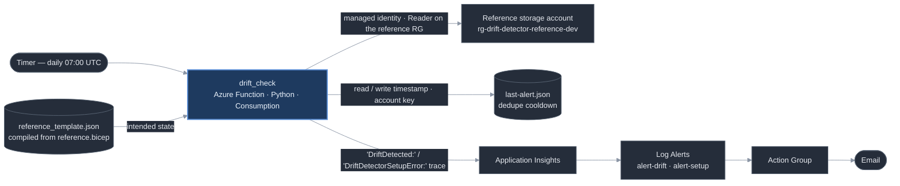

# Infrastructure Drift Detector

> Catches when someone manually changes something in the Azure portal that no longer matches what the IaC template says should be there.


## The problem

Infrastructure-as-Code only tells the truth if nobody edits around it. Someone
toggles a setting in the portal "just to test something," or clicks through a
support-article fix, and now the deployed resource and the template disagree.
Nothing warns you. The gap sits there until the next deploy quietly reverts it,
or until an audit finds it, or until the "temporary" public-access toggle turns
into an incident.

This watches one resource against its Bicep definition on a schedule and emails
you in plain English the moment they stop matching.

## What it does

- Runs on a timer, once a day (07:00 UTC).
- Reads one storage account's live configuration through the Azure SDK.
- Compares it against a small reference Bicep template — SKU, the required tag
  set, minimum TLS version, HTTPS-only, and **public blob access** — that is
  compiled to JSON and shipped inside the function, so the template is the single
  source of truth for "intended state."
- On any mismatch, logs a `DriftDetected:` line naming the property, the expected
  value, and the actual value; a Log Alert turns that into an email.
- Alerts once, then stays quiet for a cooldown window while the drift is still
  there, instead of emailing every day.
- A separate, higher-severity alert fires if the watched resource group or
  storage account has been **deleted** — so a broken detector doesn't just go
  silent.

## Architecture



[docs/architecture.md](docs/architecture.md) has the same diagram plus a short
walkthrough of the design, the auth model, and the alerting path.

**Services used:** Functions, Bicep, Storage, Log Analytics, Application
Insights, Azure Monitor, Action Groups.
**Auth:** system-assigned Managed Identity holding exactly one role — built-in
`Reader`, scoped to the *reference* resource group only. No stored secrets, no
client credentials in code or config.

## Environment

Runs against a live Azure subscription I co-administer — not a disposable
sandbox. The reference resource group and its one storage account are a
deliberate, minimal "intended state" target I stood up for this project (not a
real workload), but the subscription, the RBAC, the SDK calls, and the alerting
are all real. I have a direct interest in catching drift here since it's
infrastructure I'm actually responsible for.

## What this doesn't do

- **No auto-remediation.** It detects and alerts; it does not revert the change.
  Reverting live resources automatically is a separate, higher-risk capability
  and out of scope here.
- **One target.** V1 watches a single resource group and template. Watching a
  whole subscription is a different design (Azure Policy / `az deployment what-if`
  at scale), noted and not attempted.
- **Binary result.** "Matches" / "doesn't match" per property. No severity
  scoring or drift categorisation.
- **`what-if` is deliberately not used** — it reports phantom changes on
  no-effect properties and needs deployment-level RBAC. This compares only the
  property paths the template explicitly declares, needs only `Reader`, and can't
  produce a false positive on a clean redeploy. See
  [REVIEW.md](REVIEW.md) for the full reasoning.

## Running it yourself

The reference target is deployed by hand, **before** the detector, because the
detector's deployment grants itself `Reader` on that resource group:

```bash
az group create -n rg-drift-detector-reference-dev -l eastus2 \
  --tags portfolio=azure-devops-portfolio project=drift-detector environment=dev

az deployment group create -g rg-drift-detector-reference-dev \
  --template-file reference/reference.bicep
```

Then the detector:

```bash
azd env new drift-detector-dev
azd env set AZURE_LOCATION eastus2
azd env set NOTIFICATION_EMAIL you@example.com
azd up
```

`ALERT_COOLDOWN_DAYS` defaults to 3. After a change to `reference/reference.bicep`,
recompile the shipped artifact or CI will fail:
`az bicep build --file reference/reference.bicep --outfile function/reference_template.json`.

## Sample output

Baseline — live config matches the template:

```
Reference target in sync (0 drifted properties).
```

After manually setting **Allow Blob anonymous access → Enabled** on the reference
storage account in the portal, the next run:

```
DriftDetected: 1 property drifted - properties.allowBlobPublicAccess expected false got true
```

Trigger it again while the drift is still there:

```
Drift still present (1 property) but suppressed - last alert was within the 3-day cooldown.
```

Redeploy `reference/reference.bicep` (which sets `allowBlobPublicAccess` back to
`false`) and the very next run returns to:

```
Reference target in sync (0 drifted properties).
```

— a legitimate redeploy produces **zero** drift. The `DriftDetected:` line is
also what the Log Alert matches to send the email.

## Cost

Built entirely on Azure's free-tier grants (Functions Consumption: 1M
executions/month free; the reference storage account holds no data; Log Analytics
ingestion is capped at 1 GB/day). Estimated cost if left running indefinitely:
**under $0.05/month.** There is no Budget resource here — the sibling Cost
Sentinel project owns the subscription-wide budget guardrail.

## Built with

Designed and reviewed with Claude (architecture, spec-tightening, README),
implemented with Claude Code / Azure CLI in VS Code.

---

*Part of a portfolio series of small, self-contained Azure/M365 automations.*
