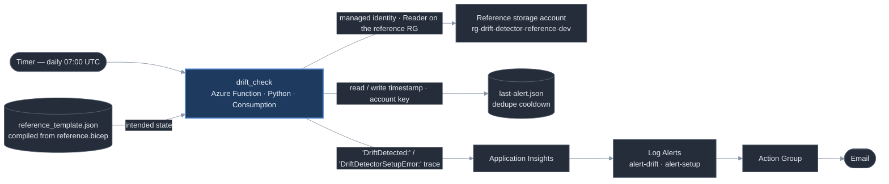

# Architecture

**Services used:** Bicep + `azd`, Azure Functions (Consumption / Y1), Storage
(dedupe blob), Log Analytics, Application Insights, Azure Monitor scheduled query
rules, Action Groups. GitHub Actions for template + test validation.

The detector never stores a "last known state" — the reference Bicep template,
compiled to `reference_template.json` and shipped inside the Function package, is
the definition of intended state. Each run reads the live reference storage
account through the `azure-mgmt-storage` SDK and compares seven declared property
paths (SKU, the portfolio tag set, TLS floor, public-blob-access, HTTPS-only). The
only persisted state is a single timestamp blob that suppresses repeat alerts
while a drift is ongoing.

**Auth:** the Function's system-assigned managed identity holds exactly one role —
built-in `Reader`, scoped to the *reference* resource group, not the
subscription and not the detector's own resource group. Reading the target's
properties needs nothing more. The dedupe blob is reached with an account-key
connection string (an app setting, encrypted at rest), so no data-plane role is
added to the identity. No stored secrets, no client credentials.

**On drift:** the Function logs a plain-English `DriftDetected:` trace to
Application Insights (needs only the connection string, no RBAC); a
`scheduledQueryRules` Log Alert matches that trace and fires an Action Group
email. A separate higher-severity rule watches for `DriftDetectorSetupError:` —
raised when the reference resource group or storage account has been deleted — so
the detector can't silently go dark.
